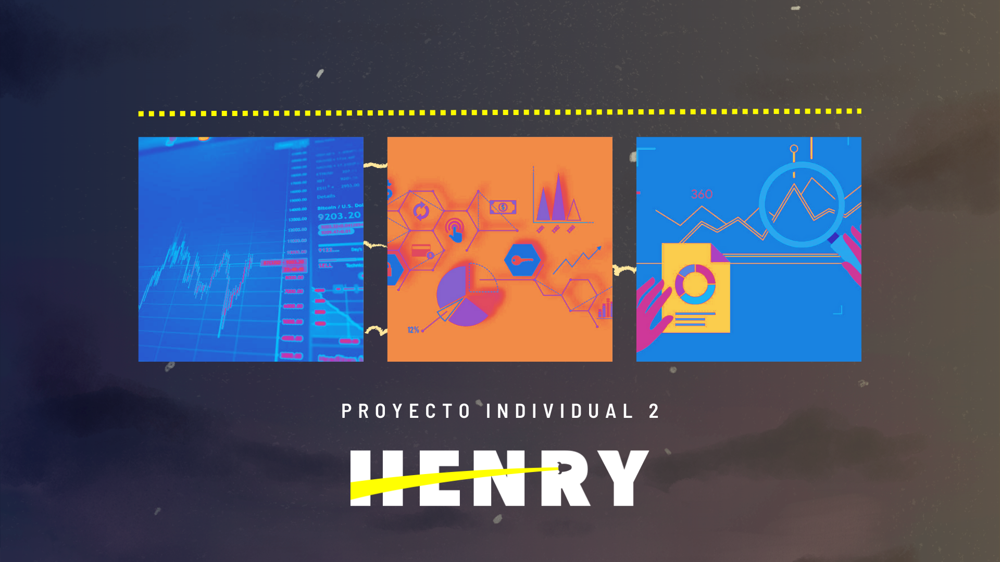

  


# __StockMarket pharmaceutical sector analysis__ 💊

 

__. El proyecto a presentarse tiene como objetivo la aplicación de técnicas de análisis de datos para la__
 __industria farmacéutica. Para ello, utilizamos herramientas como Python y Power BI, con el fin de analizar y visualizar los datos de las principales compañías farmacéuticas incluidas en el índice S&P500 y analizar lo que ocurrio en el rubro estos ultimo 20 años.__

__En primer lugar, se realizo un análisis exploratorio de los datos, con el objetivo de identificar los KPIs más relevantes y de analizar las tendencias a lo largo de los años. Este análisis permitió obtener una comprensión profunda del mercado farmacéutico y de su evolución a lo largo del tiempo.__

__De extra tambien se desarrollo un modelo de Forecasting, con el fin de predecir__
__los ingresos futuros de la industria farmacéutica y de tomar decisiones informadas de inversión. El modelo se entrenó y se ajustó__  
__utilizando los datos históricos, lo que nos permitió generar predicciones precisas y fiables para el futuro cercano.__

__Finalmente, se hizo un dashboard en Power BI para visualizar los resultados del análisis y del modelo de forecasting. Este dashboard__ __incluye visualizaciones interactivas de los KPIs relevantes, así como los resultados del modelo de forecasting. Además, incluimos una__
__explicación detallada de los términos técnicos utilizados en el proyecto, con el fin de facilitar la comprensión y la utilización de__ __la metodología por parte de otros usuarios.__

__En resumen, el proyecto representa una aproximación integral al análisis y predicción de datos en la industria farmacéutica,__ __utilizando técnicas avanzadas de análisis y visualización de datos para tomar decisiones estratégicas e informadas.__

# __Contexto__ ⚕

_El S&P 500 es un índice bursátil que representa las 500 mayores empresas de Estados Unidos que cotizan en bolsa. Estas empresas_
_pertenecen a una amplia variedad de sectores y su selección se basa en la capitalización de mercado y otros criterios financieros. 
_El S&P_ 500 es ampliamente utilizado como un indicador del desempeño general del mercado de valores de Estados Unidos._


# Algunos de los principales acontecimientos que han tenido lugar en la industria farmacéutica desde el año 2000 hasta la actualidad. 🔬

  - La aparición de nuevos tratamientos y terapias: Desde el año 2000, se han producido importantes avances en la investigación y el desarrollo de nuevos tratamientos y terapias farmacéuticas. Esto ha permitido a las empresas farmacéuticas crear productos más efectivos y de mayor calidad para tratar una amplia gama de enfermedades y afecciones de salud.

  - Fusiones y adquisiciones: En la industria farmacéutica, ha habido una gran cantidad de fusiones y adquisiciones en las últimas dos décadas. Muchas empresas han buscado consolidarse y adquirir nuevas tecnologías y productos para ampliar su cartera y aumentar su competitividad en el mercado.

  - Mayor regulación: La industria farmacéutica ha sido objeto de un mayor escrutinio y regulación en los últimos años. Esto se debe en parte a los crecientes costos de los medicamentos y a la necesidad de proteger a los consumidores de productos farmacéuticos inseguros o ineficaces.

  - Aumento de la competencia: A medida que la industria farmacéutica ha crecido, también lo ha hecho la competencia entre las empresas. Las empresas farmacéuticas se han visto obligadas a adaptarse a un mercado más competitivo, lo que ha llevado a una mayor innovación y eficiencia en la producción de medicamentos.

  - Crisis de opioides: En los últimos años, la industria farmacéutica ha estado en el centro de una crisis de opioides en los Estados Unidos. Esto ha llevado a un mayor escrutinio de la industria y a un mayor énfasis en la seguridad y la eficacia de los medicamentos recetados.

  - Surgimiento del COVID-19 y declarada pandemia mundial el 30 de enero de 2020, uno de sus efectos principales sobre el sector farmaceutico fue la redistribución de sus recursos para incrementar la capacidad de producción de medicamentos críticos para los pacientes que padecen la enfermedad y dinamizar la búsqueda de nuevos tratamientos y vacunas contra ella.


# _Empresas de ejemplo usadas de la industria farmaceutica:_ 
#### _Todas estan dentro del S&P500_  


- [(JNJ)Johnson & Johnson ](https://www.investing.com/equities/johnson-johnson)  

- [(PFE)Pfizer Inc ](https://www.investing.com/equities/pfizer)  

- [(MRK)Merck & Company Inc ](https://www.investing.com/equities/merck---co)  

- [(ABBV)AbbVie Inc ](https://www.investing.com/equities/abbvie-inc)  

- [(BMY)Bristol-Myers Squibb Company ](https://www.investing.com/equities/bristol-myer-squiib)  

- [(GSK)GSK plc DRC ](https://www.investing.com/equities/glaxosmithklein-exch)  

- [(NVS)Novartis AG ADR ](https://www.investing.com/equities/novartis-ag)  


### __Paginas con informacion extra:__
[__IFPMA__ (Federación Internacional de la Industria Farmacéutica) ](https://ifpma.org/)  
[__OCDE__ (Organización para la Cooperación y el Desarrollo Económico)) ](https://www.oecd.org/els/health-systems/pharmaceuticals.htm)  
[__OMS__ (Organización Mundial de la Salud)) ](https://www.who.int/es)

## __Forecasting Model prediction:__  📈  
#### ```(EXTRA)```   

El modelo de forecasting para el sector farmacéutico utiliza técnicas de análisis de datos para predecir los ingresos futuros de la industria (aqui usamos a __PFE__). Utilizando la biblioteca Prophet, se entrenó y ajustó el modelo utilizando los datos históricos para generar predicciones a futuro. Sin embargo, es importante tener en cuenta que los eventos imprevistos, conocidos como cisnes negros, pueden alterar las predicciones del modelo. Por lo tanto, se recomienda tener precaución en la interpretación de los resultados y considerar posibles escenarios alternativos.

 __PFE:__ Pfizer es una empresa farmacéutica estadounidense fundada en 1849. Es una de las compañías más grandes y diversificadas en la industria farmacéutica, con una amplia gama de productos en diferentes áreas terapéuticas, incluyendo oncología, enfermedades inflamatorias, enfermedades cardiovasculares y sistema nervioso central, entre otras.

Entre los medicamentos más conocidos desarrollados por Pfizer se incluyen Lipitor para el tratamiento del colesterol alto, Viagra para la disfunción eréctil, y Celebrex para el dolor y la inflamación. También ha desarrollado y comercializado varias vacunas importantes, incluyendo la vacuna contra el COVID-19 en colaboración con BioNTech.

Pfizer ha sido reconocida por su compromiso con la investigación y el desarrollo de nuevos medicamentos, y por su capacidad para llevar estos productos al mercado de manera efectiva. La compañía ha estado involucrada en varias iniciativas de salud global, incluyendo programas de lucha contra el VIH/SIDA y la malaria.


### __Y = representa el precio de cierre ajustado de la acción de Pfizer (PFE).__

### __ds = La columna ds representa la variable de fecha, que se utiliza para identificar la fecha a la que se refiere cada valor en la columna y.__

__....................................................................................................................................................................................................__  
-  


# __|__ __Contact me__  
Gmail: matiasbenitezcarrizo@gmail.com  

Github: https://github.com/Matt-CB